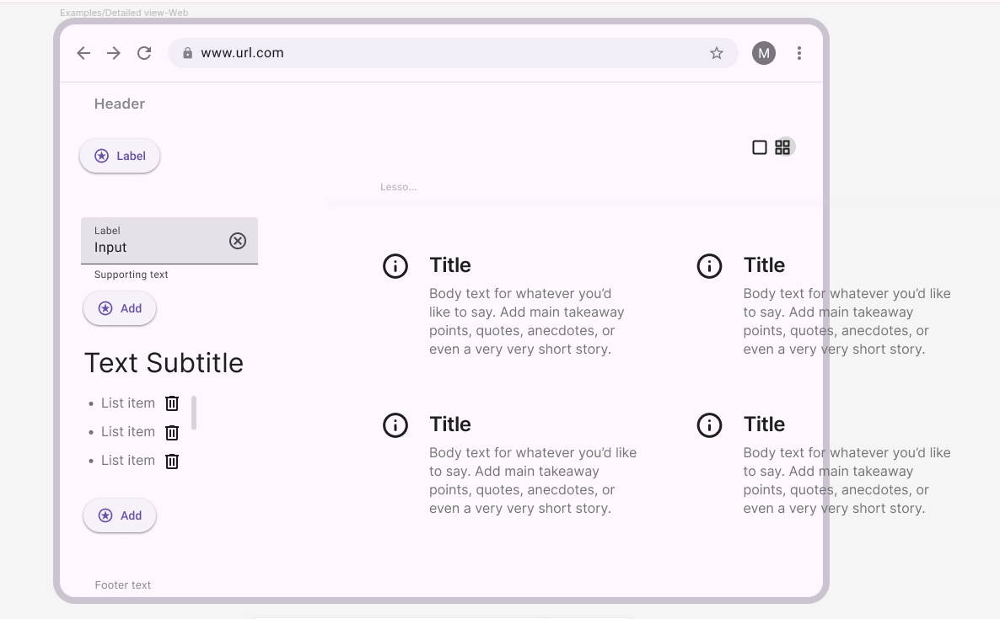

# Project Title

MindMap

## Overview

You log and visualize how you remember things you've learned. It'll start off as simple notes, will eventually be a brain animation with nodes for each lesson point

## Problem Space

Why is this app needed? What's the pain point?

For users who learn better visually because they forget the words. It's quizlet but gamified

## Features

- As a guest, I want to add a new lesson so that I can log what I've learned
- As a guest, I want to view and categorize learning cards as well as delete cards
- AS a guest, I want to input my own categories and remove categories up to a limit of 5 per user

Future

- Game to press play to play a flashcard game with the lessons in the category \*

  # Stretch Goal

  - Brain animation with nodes for each lesson point

## Hard Limit

- No server backend
- No database

## Implementation

- React
- Styled-Components

## Api's

- None

## Sitemap

- SPA

Homepage

